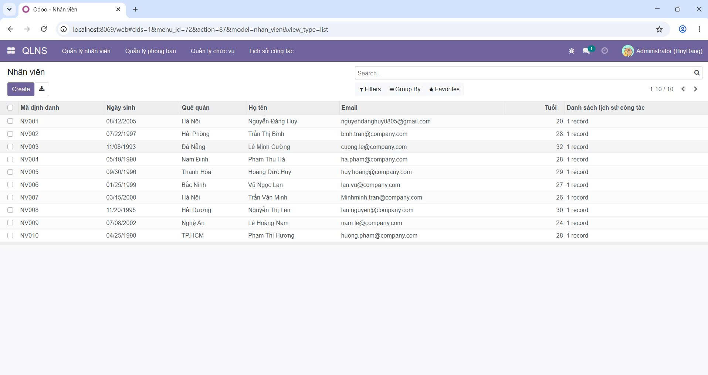
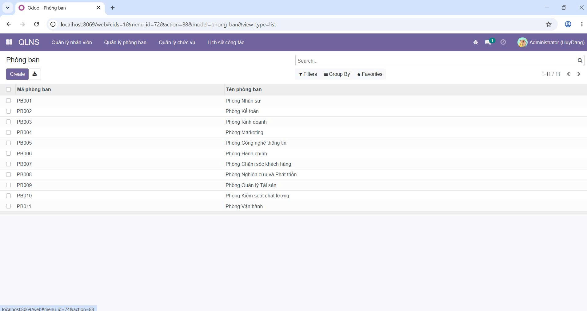
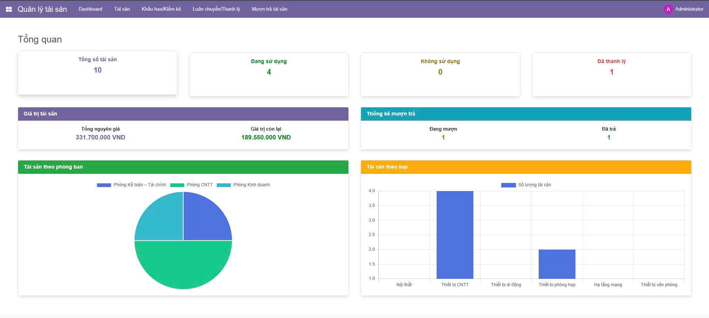
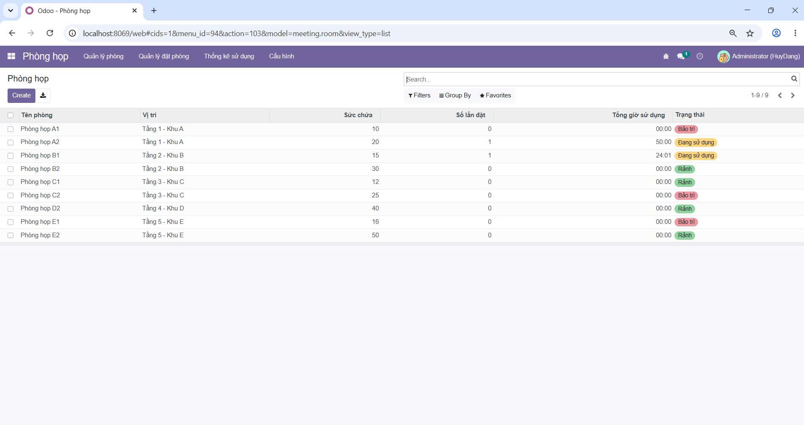
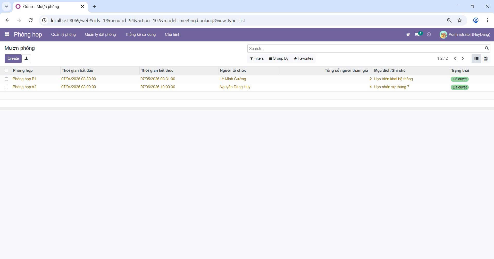
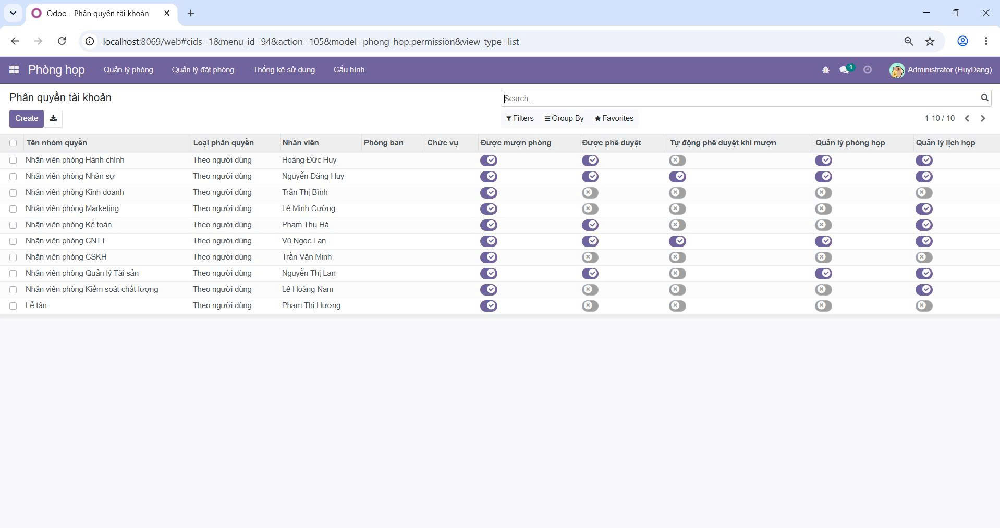
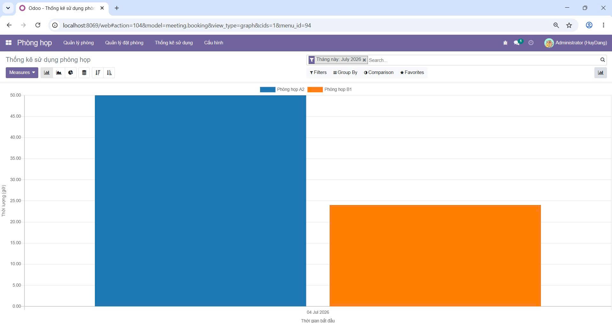
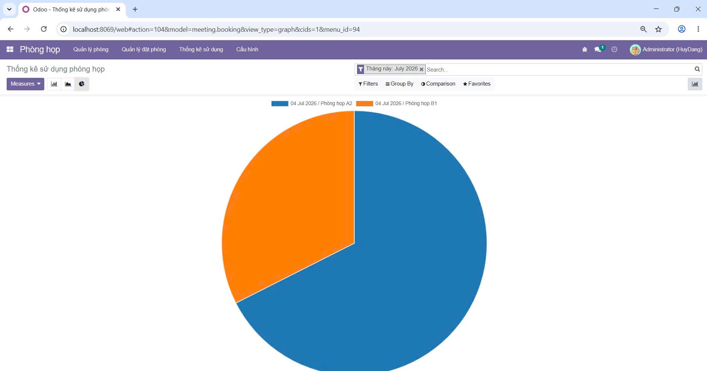

<h2 align="center">
    <a href="https://dainam.edu.vn/vi/khoa-cong-nghe-thong-tin">
    🎓 Faculty of Information Technology (DaiNam University)
    </a>
</h2>
<h2 align="center">
    PLATFORM ERP
</h2>
<div align="center">
    <p align="center">
        
        
        
    </p>

[](https://www.facebook.com/DNUAIoTLab)
[](https://dainam.edu.vn/vi/khoa-cong-nghe-thong-tin)
[](https://dainam.edu.vn)

</div>

## 📖 1. HỆ THỐNG QUẢN LÝ TÀI SẢN + PHÒNG HỌP
[](https://www.odoo.com)
[](https://www.python.org)
[](https://www.postgresql.org)
[](https://ubuntu.com)

Hệ thống Quản lý tài sản và phòng họp trên nền tảng ERP Odoo được xây dựng nhằm hỗ trợ doanh nghiệp quản lý tập trung tài sản và hoạt động sử dụng phòng họp thông qua một hệ thống thống nhất. Đề tài được phát triển trên nền tảng mã nguồn mở Odoo ERP, giúp sinh viên tiếp cận mô hình quản trị doanh nghiệp hiện đại, đồng thời rèn luyện kỹ năng phân tích yêu cầu, thiết kế cơ sở dữ liệu, xây dựng module nghiệp vụ và triển khai hệ thống ERP.

Hệ thống tích hợp hai phân hệ chính là Quản lý tài sản và Quản lý phòng họp, kết hợp với chức năng quản lý nhân sự và phân quyền người dùng để đáp ứng nhu cầu quản lý nội bộ của doanh nghiệp.

Thông qua hệ thống, doanh nghiệp có thể:

Quản lý danh mục tài sản bao gồm mã tài sản, tên tài sản, loại tài sản, phòng ban quản lý, nhân viên phụ trách, ngày mua, nguyên giá, tình trạng và vị trí sử dụng.
Theo dõi quá trình cấp phát và quản lý tài sản theo từng phòng ban hoặc nhân viên, giúp nâng cao hiệu quả quản lý và hạn chế thất thoát tài sản.
Quản lý danh sách phòng họp, thông tin sức chứa, vị trí, trang thiết bị và trạng thái sử dụng của từng phòng họp.
Cho phép nhân viên đăng ký sử dụng phòng họp, tạo lịch họp, theo dõi các lịch đặt phòng và hạn chế tình trạng trùng lịch giữa các cuộc họp.
Quản lý thông tin nhân viên và phòng ban phục vụ cho việc phân công tài sản cũng như đăng ký sử dụng phòng họp.
Cung cấp bảng điều khiển (Dashboard) tổng hợp các thông tin thống kê về tài sản, phòng họp và các hoạt động trong hệ thống, giúp nhà quản lý dễ dàng theo dõi tình hình hoạt động.
Phân quyền người dùng theo từng vai trò như Quản trị viên, Quản lý tài sản, Quản lý phòng họp và Nhân viên nhằm đảm bảo tính bảo mật và phù hợp với chức năng của từng đối tượng sử dụng.

Hệ thống Quản lý tài sản và phòng họp là một module mở rộng trên nền tảng ERP Odoo, mô phỏng các nghiệp vụ quản lý nội bộ trong doanh nghiệp. Đề tài giúp sinh viên vận dụng kiến thức về hệ thống thông tin doanh nghiệp, lập trình module Odoo bằng Python, thiết kế cơ sở dữ liệu PostgreSQL, xây dựng giao diện XML, phân quyền người dùng và triển khai một hệ thống ERP hoàn chỉnh phục vụ nhu cầu quản lý thực tế.

## 🔧 2. Các công nghệ được sử dụng
<div align="center">

### Hệ điều hành
[](https://ubuntu.com/)
### Công nghệ chính
[](https://www.odoo.com/)
[](https://www.python.org/)
[](https://developer.mozilla.org/en-US/docs/Web/JavaScript)
[](https://www.w3.org/XML/)
### Cơ sở dữ liệu
[](https://www.postgresql.org/)
</div>

## ⚙️ 4. Cài đặt

### 4.1. Cài đặt công cụ, môi trường và các thư viện cần thiết

#### 4.1.1. Tải project.
```
git clone https://github.com/NguyenDangHuy081205/HN-QTDN-17-03-N12.git
```
#### 4.1.2. Cài đặt các thư viện cần thiết
Người sử dụng thực thi các lệnh sau đề cài đặt các thư viện cần thiết

```
sudo apt-get install libxml2-dev libxslt-dev libldap2-dev libsasl2-dev libssl-dev python3.10-distutils python3.10-dev build-essential libssl-dev libffi-dev zlib1g-dev python3.10-venv libpq-dev
```
#### 4.1.3. Khởi tạo môi trường ảo.
- Khởi tạo môi trường ảo
```
python3.10 -m venv ./venv
```
- Thay đổi trình thông dịch sang môi trường ảo
```
source venv/bin/activate
```
- Chạy requirements.txt để cài đặt tiếp các thư viện được yêu cầu
```
pip3 install -r requirements.txt
```
### 4.2. Setup database

Khởi tạo database trên docker bằng việc thực thi file dockercompose.yml.
```
sudo docker-compose up -d
```
### 4.3. Setup tham số chạy cho hệ thống
Tạo tệp **odoo.conf** có nội dung như sau:
```
[options]
addons_path = addons
db_host = localhost
db_password = odoo
db_user = odoo
db_port = 5431
xmlrpc_port = 8069
```
Có thể kế thừa từ file **odoo.conf.template**
### 4.4. Chạy hệ thống và cài đặt các ứng dụng cần thiết
Lệnh chạy
```
python3 odoo-bin.py -c odoo.conf -u all
```
Người sử dụng truy cập theo đường dẫn _http://localhost:8069/_ để đăng nhập vào hệ thống.

# 5. Các chức năng chính của hệ thống

## 5.1. Module Quản lý nhân sự

Module **Quản lý nhân sự** được xây dựng nhằm hỗ trợ doanh nghiệp quản lý tập trung toàn bộ thông tin nhân viên, phòng ban, chức vụ và lịch sử công tác. Module giúp đơn giản hóa quá trình quản lý hồ sơ nhân sự, đồng thời hỗ trợ tra cứu, thống kê và theo dõi quá trình làm việc của từng nhân viên trong doanh nghiệp.

### a. Quản lý nhân viên

<p align="center">
    
</p>

**Mô tả chức năng**

Chức năng quản lý nhân viên cho phép người quản trị lưu trữ đầy đủ hồ sơ của từng nhân viên trong doanh nghiệp. Các thông tin được quản lý bao gồm mã định danh, họ và tên, ngày sinh, quê quán, địa chỉ email và tuổi. Hệ thống tự động tính tuổi dựa trên ngày sinh nhằm giảm thao tác nhập liệu và đảm bảo tính chính xác.

Ngoài ra, mỗi nhân viên đều được liên kết với lịch sử công tác, giúp theo dõi quá trình thay đổi phòng ban hoặc chức vụ trong suốt thời gian làm việc.

**Nhận xét**

Giao diện được thiết kế dưới dạng bảng danh sách nên rất trực quan và dễ sử dụng. Các thông tin được hiển thị đầy đủ theo từng cột giúp người quản lý dễ dàng tìm kiếm, lọc dữ liệu hoặc chỉnh sửa thông tin nhân viên. Việc tự động tính tuổi giúp hạn chế sai sót khi cập nhật dữ liệu, đồng thời hỗ trợ quản lý hồ sơ nhân sự hiệu quả hơn.

---

### b. Quản lý phòng ban

<p align="center">
    
</p>

**Mô tả chức năng**

Chức năng này hỗ trợ quản lý danh sách các phòng ban trong doanh nghiệp theo mã phòng ban và tên phòng ban. Mỗi phòng ban được lưu trữ riêng biệt để phục vụ cho việc phân công nhân sự, quản lý công việc và thống kê dữ liệu.

Thông tin phòng ban được liên kết trực tiếp với nhân viên và lịch sử công tác, giúp đảm bảo tính nhất quán của dữ liệu trong toàn bộ hệ thống.

**Nhận xét**

Giao diện đơn giản, khoa học và dễ theo dõi. Việc sử dụng mã phòng ban giúp tránh trùng lặp dữ liệu và thuận tiện khi tìm kiếm. Đây là nền tảng quan trọng để xây dựng cơ cấu tổ chức doanh nghiệp và hỗ trợ các chức năng quản lý khác.

---

### c. Quản lý lịch sử công tác

<p align="center">
    
</p>

**Mô tả chức năng**

Chức năng lịch sử công tác ghi nhận toàn bộ quá trình làm việc của từng nhân viên. Hệ thống lưu các thông tin như nhân viên, phòng ban, chức vụ, thời gian bắt đầu và thời gian kết thúc của từng giai đoạn công tác.

Thông qua chức năng này, người quản trị có thể theo dõi quá trình điều chuyển nhân sự, bổ nhiệm hoặc thay đổi chức vụ theo từng thời điểm.

**Nhận xét**

Giao diện hỗ trợ tìm kiếm và lọc dữ liệu theo nhân viên hoặc phòng ban, giúp việc tra cứu trở nên nhanh chóng. Việc lưu trữ lịch sử công tác giúp doanh nghiệp quản lý đầy đủ quá trình làm việc của nhân viên, đồng thời phục vụ công tác thống kê và đánh giá nhân sự.

---

# 5.2. Module Quản lý tài sản

Module **Quản lý tài sản** hỗ trợ doanh nghiệp quản lý toàn bộ tài sản từ khâu lưu trữ thông tin, theo dõi tình trạng sử dụng đến việc thống kê và đánh giá hiệu quả khai thác tài sản.

<p align="center">
    
</p>

**Mô tả chức năng**

Dashboard quản lý tài sản cung cấp cái nhìn tổng quan về toàn bộ tài sản hiện có trong doanh nghiệp. Hệ thống thống kê tổng số tài sản, số tài sản đang sử dụng, không sử dụng và đã thanh lý. Đồng thời hiển thị tổng nguyên giá và giá trị còn lại của toàn bộ tài sản.

Bên cạnh đó, hệ thống còn thống kê số lượng tài sản đang được mượn và đã trả. Hai biểu đồ trực quan giúp người quản lý theo dõi cơ cấu tài sản theo từng phòng ban và số lượng tài sản theo từng loại như máy tính, laptop, máy in, điều hòa,...

**Nhận xét**

Dashboard được trình bày trực quan với các thẻ thống kê và biểu đồ, giúp người quản lý nhanh chóng nắm bắt tình hình tài sản mà không cần xem từng bản ghi. Các biểu đồ hỗ trợ phân tích dữ liệu hiệu quả, từ đó đưa ra quyết định điều chuyển hoặc bổ sung tài sản phù hợp với nhu cầu của từng phòng ban.

---

# 5.3. Module Quản lý phòng họp

Module **Quản lý phòng họp** được xây dựng nhằm hỗ trợ doanh nghiệp quản lý phòng họp, đăng ký sử dụng phòng, phân quyền người dùng và thống kê mức độ khai thác phòng họp.

### a. Quản lý phòng họp

<p align="center">
    
</p>

**Mô tả chức năng**

Chức năng này quản lý danh sách các phòng họp của doanh nghiệp. Mỗi phòng được lưu với các thông tin như tên phòng, vị trí, sức chứa, số lần đặt, tổng thời gian sử dụng và trạng thái hiện tại.

Trạng thái phòng được cập nhật theo thời gian thực với các giá trị như **Rảnh**, **Đang sử dụng** hoặc **Bảo trì**, giúp người dùng dễ dàng lựa chọn phòng phù hợp.

**Nhận xét**

Danh sách phòng họp được trình bày rõ ràng, đầy đủ thông tin và dễ theo dõi. Người quản trị có thể nhanh chóng biết được phòng nào đang trống hoặc đang được sử dụng, từ đó hạn chế việc đặt trùng lịch và nâng cao hiệu quả khai thác phòng họp.

---

### b. Quản lý đặt phòng

<p align="center">
    
</p>

**Mô tả chức năng**

Chức năng đặt phòng cho phép người dùng đăng ký sử dụng phòng họp theo khoảng thời gian mong muốn. Hệ thống lưu lại đầy đủ thông tin về phòng họp, thời gian bắt đầu, thời gian kết thúc, người tổ chức, số lượng người tham gia và mục đích cuộc họp.

Sau khi tạo yêu cầu, hệ thống sẽ theo dõi trạng thái phê duyệt để đảm bảo việc sử dụng phòng họp diễn ra đúng quy trình.

**Nhận xét**

Việc quản lý lịch đặt phòng theo danh sách giúp người dùng dễ dàng theo dõi các cuộc họp đã đăng ký. Hệ thống góp phần hạn chế tình trạng trùng lịch và hỗ trợ doanh nghiệp quản lý lịch họp một cách khoa học.

---

### c. Phân quyền sử dụng phòng họp

<p align="center">
    
</p>

**Mô tả chức năng**

Chức năng phân quyền cho phép quản trị viên cấu hình quyền sử dụng phòng họp theo từng nhóm người dùng hoặc từng nhân viên. Các quyền bao gồm quyền mượn phòng, quyền phê duyệt yêu cầu, quyền quản lý phòng họp và quyền quản lý lịch họp.

Ngoài ra, hệ thống còn hỗ trợ thiết lập cơ chế tự động phê duyệt đối với những nhóm người dùng được cấp quyền.

**Nhận xét**

Việc phân quyền chi tiết giúp tăng tính bảo mật của hệ thống và đảm bảo mỗi người dùng chỉ được sử dụng các chức năng phù hợp với vai trò của mình. Điều này giúp quy trình quản lý phòng họp trở nên minh bạch và dễ kiểm soát hơn.

---

### d. Thống kê sử dụng phòng họp

<p align="center">
    
</p>

**Mô tả chức năng**

Biểu đồ cột thể hiện tổng thời gian sử dụng của từng phòng họp trong khoảng thời gian được lựa chọn. Dữ liệu được tổng hợp tự động từ các lịch đặt phòng đã được phê duyệt.

**Nhận xét**

Biểu đồ giúp người quản lý dễ dàng so sánh mức độ sử dụng giữa các phòng họp, từ đó đánh giá hiệu quả khai thác và cân đối việc sử dụng tài nguyên.

---

<p align="center">
    
</p>

**Mô tả chức năng**

Biểu đồ tròn biểu diễn tỷ lệ thời gian sử dụng của từng phòng họp trong kỳ thống kê. Mỗi phần của biểu đồ tương ứng với mức độ sử dụng của một phòng họp.

**Nhận xét**

Thông qua biểu đồ tròn, người quản lý có thể nhanh chóng xác định phòng họp được sử dụng nhiều hoặc ít nhất. Đây là cơ sở để tối ưu việc phân bổ phòng họp, lập kế hoạch bảo trì hoặc mở rộng cơ sở vật chất khi cần thiết.

This project is developed for educational purposes. All rights reserved.


© 2024 AIoTLab, Faculty of Information Technology, DaiNam University. All rights reserved.

---

    
