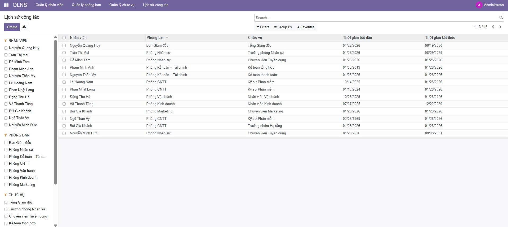
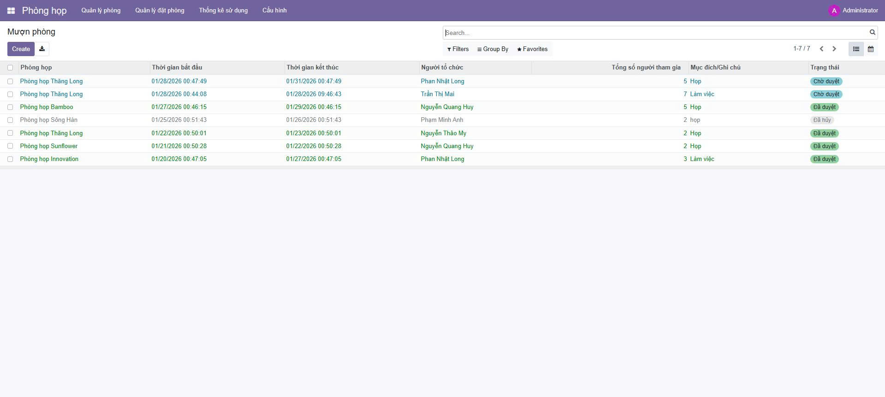
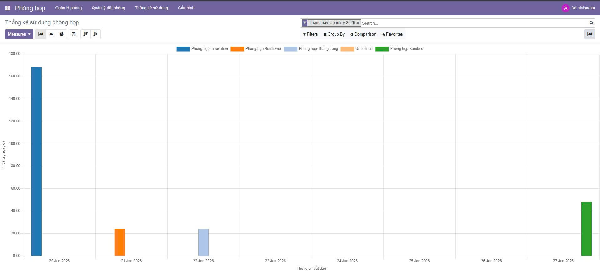
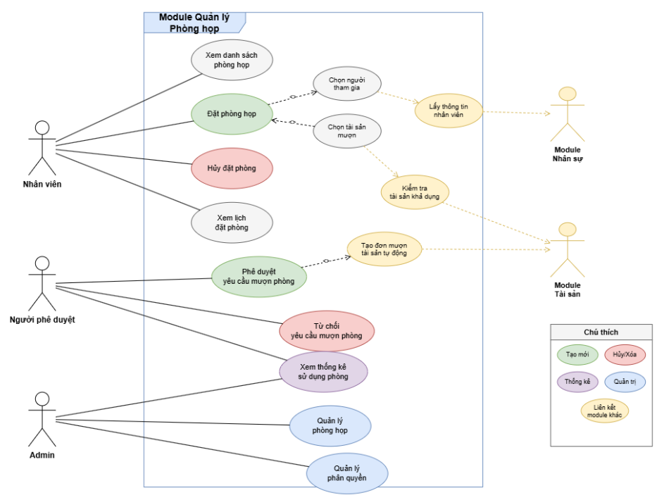
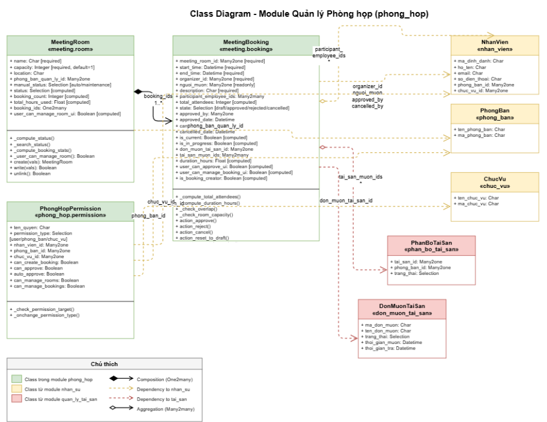
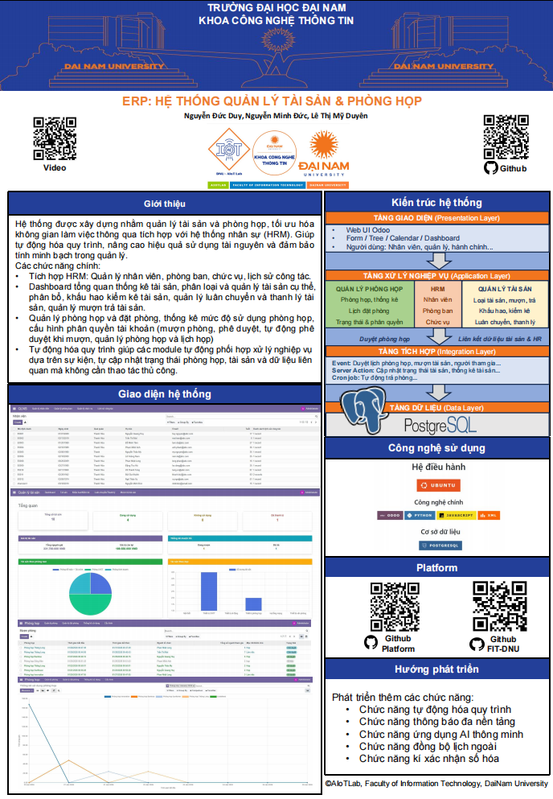

<h2 align="center">
    <a href="https://dainam.edu.vn/vi/khoa-cong-nghe-thong-tin">
    🎓 Faculty of Information Technology (DaiNam University)
    </a>
</h2>
<h2 align="center">
    PLATFORM ERP
</h2>
<div align="center">
    <p align="center">
        
        
        
    </p>

[](https://www.facebook.com/DNUAIoTLab)
[](https://dainam.edu.vn/vi/khoa-cong-nghe-thong-tin)
[](https://dainam.edu.vn)

</div>

## 📖 1. Giới thiệu
Platform ERP là nền tảng học tập và thực hành doanh nghiệp được xây dựng dựa trên mã nguồn mở Odoo, phục vụ học phần Thực tập doanh nghiệp tại Khoa Công nghệ Thông tin – Trường Đại học Đại Nam.

Hệ thống được thiết kế theo mô hình ERP thực tế, cho phép sinh viên:

Tiếp cận kiến trúc hệ thống quản trị doanh nghiệp hiện đại

Phát triển và mở rộng các module nghiệp vụ trên Odoo

Thực hành phân tích yêu cầu, thiết kế cơ sở dữ liệu, xây dựng chức năng và phân quyền người dùng

Mô phỏng quy trình vận hành của doanh nghiệp (nhân sự, phòng ban, phòng họp, phân quyền, thống kê)

Platform ERP đóng vai trò là nền tảng dùng chung, trên đó sinh viên triển khai các project theo từng khóa, bám sát bài toán thực tế của doanh nghiệp.

## 🔧 2. Các công nghệ được sử dụng
<div align="center">

### Hệ điều hành
[](https://ubuntu.com/)
### Công nghệ chính
[](https://www.odoo.com/)
[](https://www.python.org/)
[](https://developer.mozilla.org/en-US/docs/Web/JavaScript)
[](https://www.w3.org/XML/)
### Cơ sở dữ liệu
[](https://www.postgresql.org/)
</div>

## 🚀 3. Các project đã thực hiện dựa trên Platform

Một số project sinh viên đã thực hiện:
- #### [Khoá 15](./docs/projects/K15/README.md)
- #### [Khoá 16](./docs/projects/K16/README.md)
- #### [Khoá 17](./docs/projects/K17/README.md)
## ⚙️ 4. Cài đặt

### 4.1. Cài đặt công cụ, môi trường và các thư viện cần thiết

#### 4.1.1. Tải project.
```
git clone https://github.com/nguyenducduy2612/TTDN-16-01-N12
```
#### 4.1.2. Cài đặt các thư viện cần thiết
Người sử dụng thực thi các lệnh sau đề cài đặt các thư viện cần thiết

```
sudo apt-get install libxml2-dev libxslt-dev libldap2-dev libsasl2-dev libssl-dev python3.10-distutils python3.10-dev build-essential libssl-dev libffi-dev zlib1g-dev python3.10-venv libpq-dev
```
#### 4.1.3. Khởi tạo môi trường ảo.
- Khởi tạo môi trường ảo
```
python3.10 -m venv ./venv
```
- Thay đổi trình thông dịch sang môi trường ảo
```
source venv/bin/activate
```
- Chạy requirements.txt để cài đặt tiếp các thư viện được yêu cầu
```
pip3 install -r requirements.txt
```
### 4.2. Setup database

Khởi tạo database trên docker bằng việc thực thi file dockercompose.yml.
```
sudo docker-compose up -d
```
### 4.3. Setup tham số chạy cho hệ thống
Tạo tệp **odoo.conf** có nội dung như sau:
```
[options]
addons_path = addons
db_host = localhost
db_password = odoo
db_user = odoo
db_port = 5431
xmlrpc_port = 8069
```
Có thể kế thừa từ file **odoo.conf.template**
### 4.4. Chạy hệ thống và cài đặt các ứng dụng cần thiết
Lệnh chạy
```
python3 odoo-bin.py -c odoo.conf -u all
```
Người sử dụng truy cập theo đường dẫn _http://localhost:8069/_ để đăng nhập vào hệ thống.

## 📝 5. Các Module chức năng chính

### 5.1. Module quản lý nhân sự
Module Quản lý nhân sự hỗ trợ quản lý toàn bộ thông tin nhân sự và cơ cấu tổ chức của doanh nghiệp, giúp theo dõi quá trình làm việc và phân công nhân sự một cách hiệu quả.
<p align="center">
        
    </p>
    
- Quản lý nhân viên:
  
  Lưu trữ thông tin cá nhân: mã nhân viên, họ tên, ngày sinh, quê quán, email

  Tự động tính tuổi dựa trên ngày sinh

  Liên kết với lịch sử công tác của từng nhân viên
  
- Quản lý phòng ban:
  
  Quản lý danh sách phòng ban theo mã và tên

  Hỗ trợ tổ chức cơ cấu doanh nghiệp

  Gán nhân viên vào phòng ban tương ứng
  
- Quản lý chức vụ:
  
  Quản lý các chức danh trong doanh nghiệp (Giám đốc, Trưởng phòng, Nhân viên, Kỹ sư,…)

  Liên kết chức vụ với lịch sử công tác
  
- Quản lý lịch sử công tác:
  
  Theo dõi quá trình làm việc của nhân viên theo từng giai đoạn

  Lưu thông tin phòng ban, chức vụ, thời gian bắt đầu – kết thúc

  Hỗ trợ truy vết và thống kê quá trình công tác

### 5.2. Module quản lý tài sản
Module Quản lý tài sản giúp doanh nghiệp quản lý, theo dõi và kiểm soát các tài sản phục vụ hoạt động nội bộ, đảm bảo sử dụng hiệu quả và minh bạch.
<p align="center">
        
    </p>
    
- Quản lý danh mục tài sản:

  Lưu trữ thông tin tài sản: mã tài sản, tên tài sản, loại tài sản

  Phân loại tài sản (thiết bị văn phòng, thiết bị CNTT, nội thất,…)
  
- Quản lý trạng thái tài sản:
  
  Theo dõi trạng thái: đang sử dụng, chưa sử dụng, bảo trì, hỏng

  Cập nhật tình trạng tài sản theo thời gian thực
  
- Quản lý mượn, trả tài sản:
  
  Ghi nhận thông tin nhân viên mượn tài sản

  Theo dõi thời gian mượn, thời gian trả

  Hỗ trợ kiểm soát trách nhiệm sử dụng tài sản
  
- Thông kê và báo cáo:
  
  Thống kê số lượng tài sản theo loại và trạng thái

  Hỗ trợ đánh giá hiệu quả khai thác tài sản doanh nghiệp
  
### 5.3. Module quản lý phòng họp
Module Quản lý phòng họp hỗ trợ quản lý phòng họp, đặt lịch và theo dõi việc sử dụng phòng họp trong doanh nghiệp một cách trực quan và thuận tiện.
<p align="center">
        
    </p>
<p align="center">
        
images/thongkephonghop.jpg
- Quản lý phòng hop:
  Quản lý thông tin phòng họp: tên phòng, vị trí, sức chứa

  Theo dõi trạng thái phòng: rảnh, đang sử dụng, bảo trì

  Thống kê số lần và tổng thời gian sử dụng phòng
  
- Quản lý đặt/mượn phòng:
  
  Tạo yêu cầu mượn phòng theo khung thời gian cụ thể

  Ghi nhận người tổ chức, số lượng người tham gia, mục đích sử dụng

  Theo dõi trạng thái yêu cầu: chờ duyệt, đã duyệt, hủy

- Phê duyệt và phân quyền:
  
  Cho phép phê duyệt hoặc từ chối yêu cầu mượn phòng

  Hỗ trợ tự động phê duyệt theo phân quyền người dùng
  
- Thống kê sử dụng phòng họp:
  
  Biểu đồ thống kê thời gian sử dụng theo ngày, tháng

  So sánh mức độ sử dụng giữa các phòng họp

  Hỗ trợ tối ưu hóa việc phân bổ tài nguyên phòng họp

## 6. Sơ đồ Use case, class diagram
- Use case:
  <p align="center">
        
    </p>

- Class diagram:
  <p align="center">
        
    </p>
## 📝 7. Poster Nhóm 12
  <p align="center">
        
    </p>
## 📝 8. License

© 2024 AIoTLab, Faculty of Information Technology, DaiNam University. All rights reserved.

---

    
